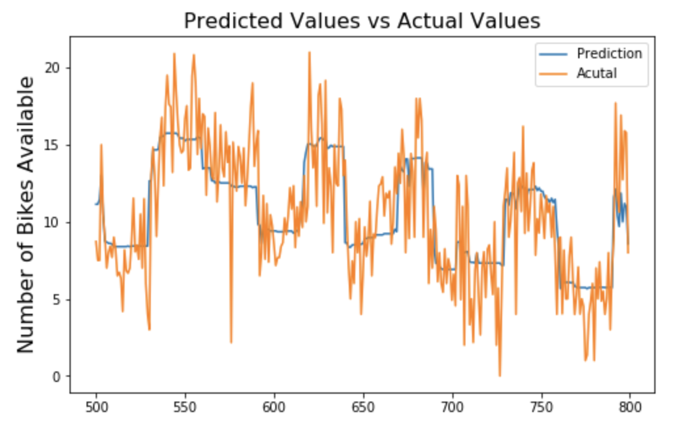
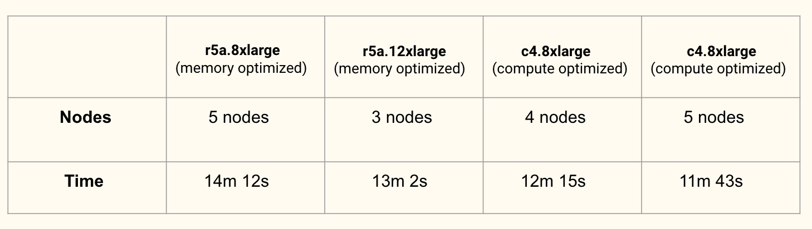

# Predicting bike share availability with H2O and Spark on AWS EMR

Tools Used:
- Spark SQL
- Spark Machine Learning
- H2O ML, Deep Learning and AutoML
- AWS EMR Clusters
- Plotly

Data Source: https://www.kaggle.com/benhamner/sf-bay-area-bike-share
Data Size: 4GB
- station.csv - Contains data that represents a station where users can pick up or return bikes.
- status.csv - Data about the number of bikes and docks available for a given station and minute.
- trips.csv - Data about individual bike trips
- weather.csv - Data about the weather on a specific day for certain zip codes

Predict number of bikes available at a given station with:
- station information
- weather condition
- type of day (weekday/weekend)
- hour of the day
- population of the neighborhood

Data Pipeline:
- [Exploratory Data Analysis](EDA_preprocessing.ipynb)
- [Data Visulization with Plotly](EDA_visulization.ipynb)
- [Data Preprocessing + Spark ML Models on AWS EMR Clusters](EMR_SparkML_modelling.ipynb)
- [H2O ML, Deep Learning, and Auto ML](H2O_modelling.ipynb)

Prediction Result: 

- For Spark ML Models, our best model is Random Forest, with an RMSE of 2.7  
- For H2O Models, AutoML's XGBoost model has an RMSE of 2.38

Run Time Comparison on different AWS EMR Clusters:

Group member: Esther Liu, Marine Lin, Akankasha, Lexie
